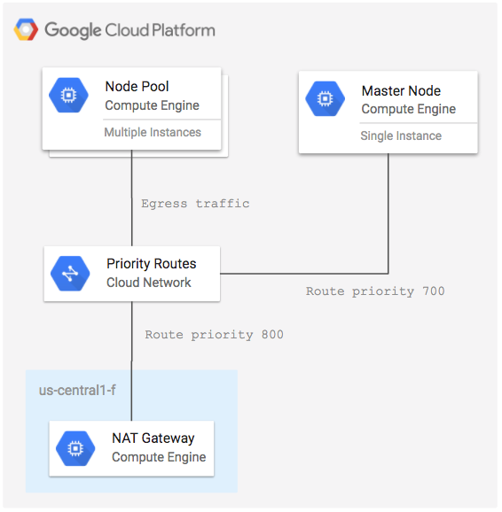

# NAT Gateway for GKE Nodes

This example creates a NAT Gateway and Compute Engine Network Routes to route outbound traffic from an existing GKE cluster through the NAT Gateway instance.

**Figure 1.** *diagram of Google Cloud resources*



## Setup Environment

```
gcloud auth application-default login
export GOOGLE_PROJECT=$(gcloud config get-value project)
```

This example assumes you have an existing Container Engine cluster.

### Get Master IP and Node Tags

Record the target cluster name and zone:

```
CLUSTER_NAME=dev
ZONE=us-central1-f
```

Save the IP address of the GKE master and the node pool nework tag name to the tfvars file:

```
echo "gke_master_ip = \"$(gcloud container clusters describe ${CLUSTER_NAME} --zone ${ZONE} --format='get(endpoint)')\"" > terraform.tfvars
echo "gke_node_tag = \"$(gcloud compute instance-templates describe $(gcloud compute instance-templates list --filter=name~gke-${CLUSTER_NAME} --limit=1 --uri) --format='get(properties.tags.items[0])')\"" >> terraform.tfvars
```

## Run Terraform

```
terraform init
terraform plan
terraform apply
```

## Verify NAT Gateway Routing

Run a sample app to inspect the external IP seen by a pod:

```
kubectl run example --image centos:7 -- bash -c 'while true; do curl -s http://ipinfo.io/ip; sleep 5; done'
```

```
kubectl logs --tail=10 $(kubectl get pods --selector=run=example --output='jsonpath={.items..metadata.name}')
```

The IP address shown in the pod output should match the value of the NAT Gateway `external_ip`. Get the external IP of the NAT Gateway by running the command below:

```
terraform output -module=nat -json | jq -r .external_ip.value
```

## Cleanup

Remove all resources created by terraform:

```
terraform destroy
```